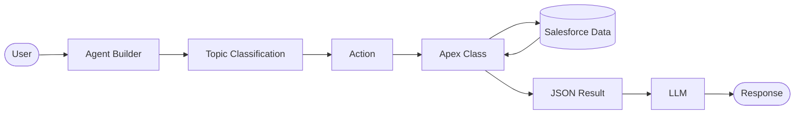

# AccountScout

AccountScout is an Agentforce agent that gives sales and support reps a single conversational front door onto account intelligence: it pulls a live snapshot of an Account (details, open opportunities, top contacts, open tasks), searches the shared content library for relevant collateral, and writes an audit trail of every topic it handles so the business can review what the agent said and why. The agent itself is configured in Agent Builder; this repository contains the three backing Apex actions, the audit log object, and everything needed to deploy them to an org.

## Prerequisites

- [Salesforce CLI (`sf`)](https://developer.salesforce.com/tools/salesforcecli) v2 or later
- [Visual Studio Code](https://code.visualstudio.com/)
- [Salesforce Extension Pack](https://marketplace.visualstudio.com/items?itemName=salesforce.salesforcedx-vscode) for VS Code
- A Salesforce org with Agentforce enabled (Developer Edition, sandbox, or production) — referred to below as `devhub`

## Quick start

```bash
# Authenticate to your org
sf org login web --alias devhub --set-default

# Deploy all metadata (Apex classes, custom object, fields)
sf project deploy start --target-org devhub

# Run the Apex test suite with code coverage
sf apex run test --target-org devhub --wait 5 --code-coverage --result-format human
```

All three Apex classes carry >85% test coverage individually, and the bundle satisfies the org-wide 75% minimum required to deploy to production.

## Wiring the actions into Agent Builder

Create (or open) the **AccountScout** agent in Agent Builder and add the following actions. Each action wraps one Apex invocable method; the "when to use" description is the text to paste into the action's instructions so the LLM knows when to invoke it.

### Topic: Account Research

**Action 1 — Get Account Snapshot**
- Apex class / method: `GetAccountSnapshot.getSnapshot`
- Invocable label: `Get Account Snapshot`
- When to use (paste into Agent Builder): *"Use this action whenever the user asks about a specific Account's status, health, open deals, key contacts, or outstanding follow-up work. Requires a valid 18-character Account ID — resolve the Account by name first if the user only gives a name."*
- Input: `accountId` (Account ID, required)
- Output: `snapshotJson` (String) — parse this JSON to summarize the account, its up-to-5 open opportunities, up-to-3 most recent contacts, and its count of open tasks

**Action 2 — Search Content Library**
- Apex class / method: `SearchContentLibrary.search`
- Invocable label: `Search Content Library`
- When to use (paste into Agent Builder): *"Use this action when the user asks for sales collateral, case studies, guides, or other documents related to a topic or industry. Pass the user's keywords as the search query."*
- Input: `queryText` (String, required), `maxResults` (Integer, optional — defaults to 3 if omitted)
- Output: `resultsJson` (String) — a JSON array of `{id, title, description, fileType}` to present as document recommendations

### Topic: Activity Logging

**Action 3 — Log Agent Interaction**
- Apex class / method: `LogAgentInteraction.logInteraction`
- Invocable label: `Log Agent Interaction`
- When to use (paste into Agent Builder): *"Call this action at the end of every conversation turn where the agent answered a question, refused a request, or hit an error, so the interaction is captured for audit. Always run this last, after any other actions in the turn."*
- Input: `topicName`, `userQuery`, `outcome` (`success` | `refusal` | `error`), `citedRecordIds` (comma-separated record Ids used to answer, or an empty string if none) — all required
- Output: `logId` (Id of the created `AccountScoutLog__c` record, or null if the insert failed)

## Sample invocation JSON

This is the shape of the request Agent Builder sends when it invokes each action (one input record per list, matching the bulkified Apex signature).

**Get Account Snapshot**
```json
{
  "inputs": [
    {
      "accountId": "001XXXXXXXXXXXXXXX"
    }
  ]
}
```

**Search Content Library**
```json
{
  "inputs": [
    {
      "queryText": "healthcare implementation guide",
      "maxResults": 3
    }
  ]
}
```

**Log Agent Interaction**
```json
{
  "inputs": [
    {
      "topicName": "Account Research",
      "userQuery": "What's the status of Acme Corporation?",
      "outcome": "success",
      "citedRecordIds": "001XXXXXXXXXXXXXXX,006XXXXXXXXXXXXXXX"
    }
  ]
}
```

## Architecture


